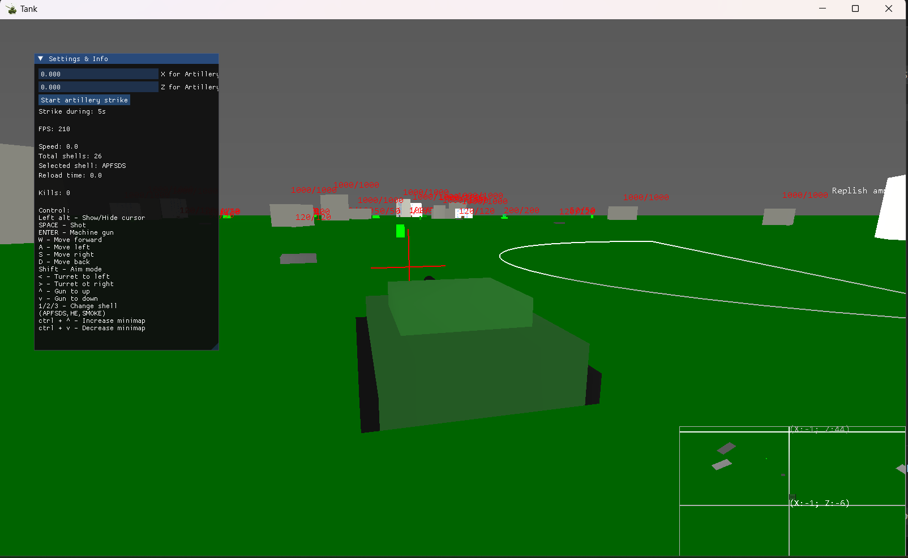
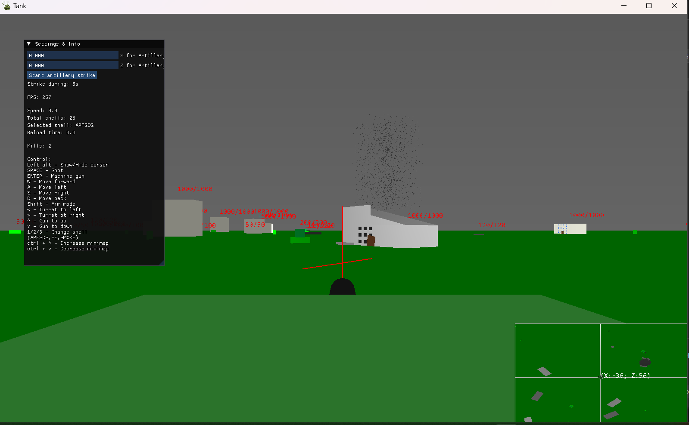
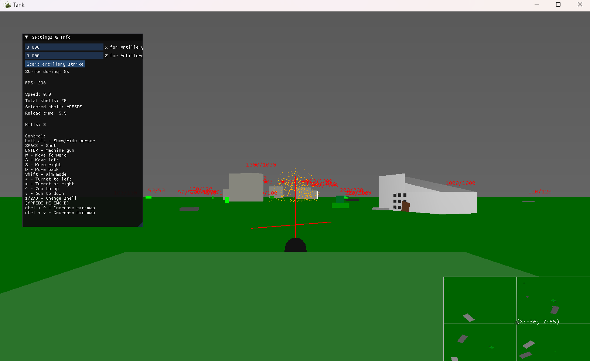

## General: 
This is a **local tank game** where the goal is to destroy various enemies (soldiers, tanks, houses, etc.). 
Each enemy has its own HP pool, and each shell deals damage.

## Features: **Positional sound** with attenuation, **kill chat**, **AI**, **Json config** ,**different shell types** (APFSDS, HE, Smoke), 
**Explosion** and **fire effects** through points,**destruction of buildings** when a shell hits or a tank crashes into them, 
small **AI** for enemy tanks that **turns the turret towards the player** if he is within range and **shoots at him**.
tank crashes into objects and destroys them, **lighting**, a **minimap** with dynamic data (your position, enemies around, effects, etc.), 
**Arced projectile trajectory**, **ammo limitation**, the **ability to replenish ammo** at a special point, and **calling an artillery**
strike at specific coordinates with a margin of errorь **data base** for kills and death.

## Technical nuances: 
  - Each logical system is implemented in a separate file
  - Entity-Component-System architecture for managing all enemies. It works faster with the processor because the data is stored in lists,
    and such a system is also much easier to scale.
  - Object-Oriented Programming for tanks, shells, sound...
  - Json config to change values ​​without recompiling the code

## Libraries Used:
  - Renderer: gl, opengl, glfw3, glu
  - Sound: ALuint
  - GUI: ImGui
  - Data Base: SQLite3
  - Config: Json(nlohmann)
  - Other: chrono, cstdint, cstdlib, algorithm, ctime, stbimage

## Required:
  - For launch this game you need all .dll files in folder "DLLs"

## Demo:

